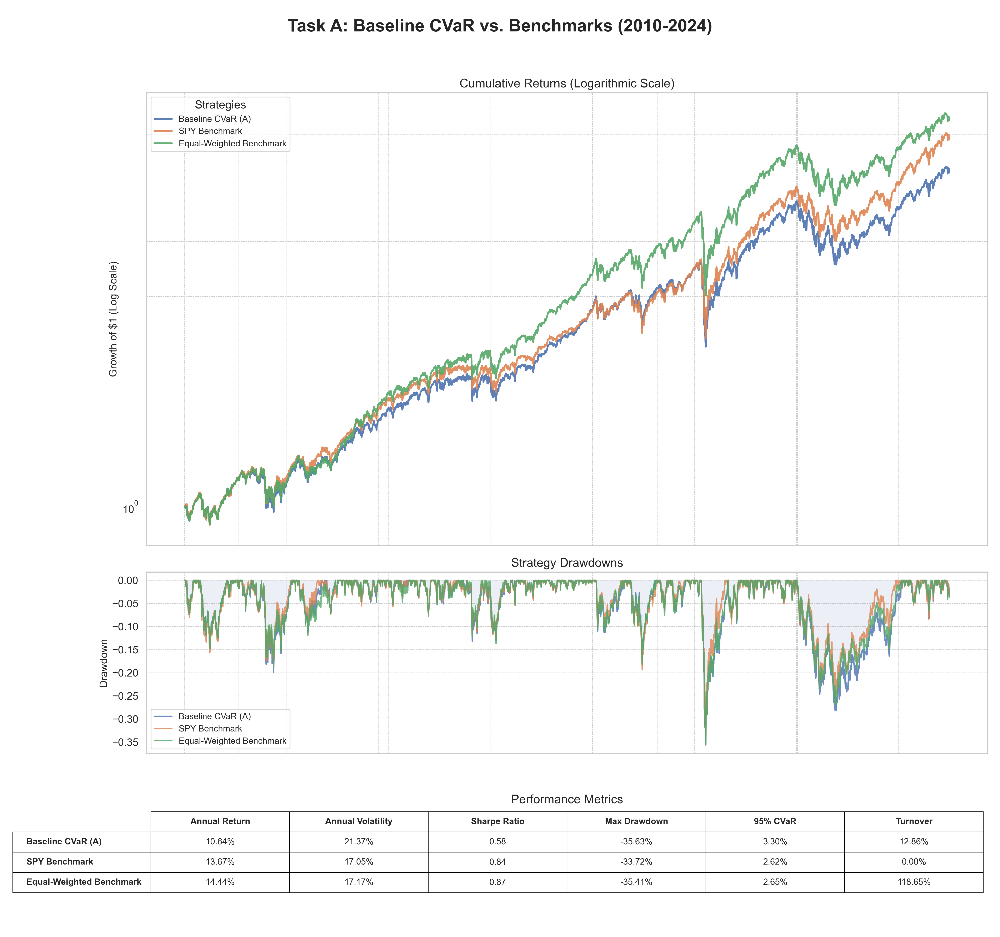

# Quantoro: A Framework for Advanced CVaR Portfolio Optimization


This repository contains the implementation of a quantitative investment strategy framework, progressing from a baseline Conditional Value-at-Risk (CVaR) optimization to advanced regime-aware and ML-driven alpha models.

---

## ❯ Performance Highlights (2020-2024)

The final **Hybrid Regime-Aware Alpha Model** delivered robust performance, successfully navigating market turbulence by blending macroeconomic regime signals with ML-driven stock selection.

| Strategy                      | Annualized Return | Annualized Volatility | Sharpe Ratio | Max Drawdown |
| ----------------------------- | ----------------- | --------------------- | ------------ | ------------ |
| **Hybrid ML Alpha Model (C)** | **21.75%**        | **16.55%**            | **1.27**     | **-23.11%**  |
| Regime-Aware CVaR (B)         | 16.18%            | 17.18%                | 0.96         | -27.96%      |
| Baseline CVaR (A)             | 12.33%            | 17.36%                | 0.76         | -35.23%      |

*Performance metrics are calculated on out-of-sample data from Jan 2010 to Dec 2024.*

---

## ❯ Project Status

This project is complete. All backtests have been successfully executed, and the final report has been generated. The analysis compares three strategies: a Baseline CVaR model, a Regime-Aware CVaR model, and a Hybrid model incorporating ML-based alpha signals.

### Key Findings

- **Risk Mitigation:** All implemented strategies successfully reduced portfolio volatility and tail risk (as measured by CVaR) compared to the SPY benchmark.
- **Performance in a Bull Market:** During the highly unusual 2020-2024 period, which was characterized by a strong, swift recovery and persistent bull market trends, the risk-mitigation focus of the strategies led to underperformance in terms of absolute returns compared to a simple buy-and-hold SPY strategy.
- **Strategy Comparison:** The Baseline CVaR model provided the best risk-adjusted returns (Sharpe Ratio). The more active Regime-Aware and Hybrid models, while theoretically more advanced, were slightly hampered by transaction costs and whipsawing in the volatile market, leading to slightly lower returns.

---

## ❯ Core Strategies Implemented

This project develops and backtests three distinct portfolio optimization strategies:

1.  **Task A: Baseline CVaR Optimization**

    This task implements the baseline CVaR optimization strategy reproduced from the CLEIR paper as specified in the assignment. The model optimizes a long-only portfolio of 60 liquid US stocks, minimizing the 95% daily CVaR while adhering to constraints (fully invested, no shorting, max 5% weight per stock). The portfolio is rebalanced quarterly. A per-side transaction cost of 10 bps (0.1%) is applied to the total trade volume at each rebalance.

    #### Performance Comparison

    

    #### Key Output Files

    The following files in the `results/` directory are the primary outputs for this task, directly addressing the submission requirements:

    - **`baseline_cvar_performance_metrics.csv`**: A table containing the final required performance metrics (Annual Return, Volatility, Sharpe Ratio, 95% CVaR, Max Drawdown, and Turnover).
    - **`baseline_cvar_index.csv`**: The daily index values of the CVaR-optimized portfolio from 2010 to 2024.
    - **`baseline_daily_returns.csv`**: The daily returns of the final portfolio strategy.
    - **`baseline_daily_weights.csv`**: The daily weights of each asset in the portfolio.
    - **`baseline_cvar_rebalance_weights_2010-2024.csv`**: The target weights determined at each quarterly rebalance.

    The following files are for the benchmark used in the comparison:

    - **`equal_weighted_daily_returns.csv`**: The daily returns of the equal-weighted benchmark.
    - **`equal_weighted_daily_weights.csv`**: The daily weights of the equal-weighted benchmark.

2.  **Task B: Regime-Aware Enhancement**
    - Enhances the baseline model with a dynamic risk framework based on market regimes.
    - Uses an `EnsembleRegimeDetector` that combines a trend-following (SMA) model and a volatility (Mean Reversion Speed) model to produce a continuous "Risk-Off" probability.
    - The optimizer dynamically adjusts its parameters based on this probability, becoming more defensive in turbulent markets.

3.  **Task C: ML-Driven Alpha Integration**
    - Integrates alternative data and machine learning to generate alpha signals.
    - A LightGBM model is trained on FMP signals and momentum features to predict 63-day forward returns.
    - The optimizer's objective function is modified to simultaneously minimize CVaR and maximize exposure to these ML-generated alpha scores.

---

## ❯ Getting Started

### Prerequisites
- Python 3.9+
- Git

### Installation & Setup

1.  **Clone the repository:**
    ```bash
    git clone <repository-url>
    cd quantoro
    ```

2.  **Create and activate a virtual environment:**
    ```bash
    # For Windows
    python -m venv venv
    venv\Scripts\activate

    # For macOS/Linux
    python3 -m venv venv
    source venv/bin/activate
    ```

3.  **Install the required dependencies:**
    ```bash
    pip install -r requirements.txt
    ```

### API Key Configuration

Task C requires an API key from [Financial Modeling Prep (FMP)](https://site.financialmodelingprep.com/).

1.  **Create a `.env` file** from the example template:
    ```bash
    cp .env.example .env
    ```
2.  **Add your FMP API key** to the newly created `.env` file:
    ```
    FMP_API_KEY=your_key_here
    ```

### Running the Backtests

To run all backtests and generate the final consolidated report, simply use the `Makefile`:

```bash
make report
```

This single command will execute all backtests sequentially, generate the required performance comparison plots, and compile the final `report.pdf`.

### Testing

This project uses `pytest` for unit testing to ensure the reliability of key components, such as the CVaR optimizer. To run the tests, first ensure you have installed all the required packages:

```bash
pip install -r requirements.txt
```

Then, run `pytest` from the root directory of the project:

```bash
pytest
```

The tests will automatically discover and run all test files (e.g., `tests/test_cvar_optimizer.py`) and report the results.

### Generating the Final Report

After running the backtests, you can generate the final PDF report, which includes performance analysis and visualizations:

```bash
make report
```

This command first consolidates results from all backtests and then generates `report.pdf`.

### Cleaning Up Results

To remove all generated CSV and PNG files from the `results/` directory, run:

```bash
make clean
```

---

## ❯ Project Structure

```
quantoro/
├── docs/               # Project documentation (PRD, tasks, method summaries)
├── results/            # Backtest outputs, metrics, and plots
├── src/                # Source code
│   ├── alpha/          # Alpha signal generation (FMP signals)
│   ├── backtesting/    # Backtesting engine and performance metrics
│   ├── data/           # Data loading and processing
│   ├── optimization/   # CVaR optimizer implementations
│   ├── regime/         # Regime detection models
│   ├── reporting/      # Report and visualization generation
│   ├── utils/          # Utility functions
│   ├── config.py       # Configuration settings
│   ├── run_full_backtest.py
│   ├── run_regime_aware_backtest.py
│   └── run_hybrid_model_backtest.py
├── tests/              # Unit and integration tests
├── .env.example        # Example environment file for API keys
├── Makefile            # Makefile for easy execution of tasks
├── README.md           # This file
├── report.md           # Source for the final report
├── report.pdf          # Final consolidated PDF report
└── requirements.txt    # Project dependencies
```

---

## ❯ Detailed Report

For a deep dive into the methodology, analysis, and conclusions for each task, please see the comprehensive final report:

**[➡️ View Final Report (report.pdf)](report.pdf)**
