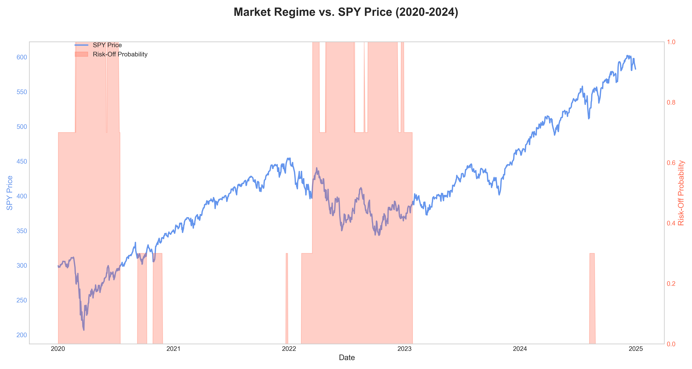

# Task B: Interpretability Report for the Ensemble Regime Model

## 1. Introduction

This report details the interpretability of the advanced regime-aware CVaR model. The strategy's core innovation is the `EnsembleRegimeDetector`, which combines two distinct but complementary models to produce a robust, data-driven assessment of market risk. The goal is to demonstrate that this probabilistic risk assessment aligns with known market events and provides a rational basis for the model's dynamic strategy adjustments.

## 2. Probabilistic Regime Detection

- **Model**: The `EnsembleRegimeDetector` blends signals from two sub-models:
    1.  **`SMARegimeDetector`**: A classic 50/200-day Simple Moving Average (SMA) crossover model, which captures long-term trend direction.
    2.  **`VolatilityThresholdDetector`**: A model that identifies high-volatility periods by checking if the 21-day rolling volatility of SPY returns exceeds its historical 75th percentile.
- **Signal**: The ensemble model produces a continuous probability (0.0 to 1.0) of being in the 'Risk-Off' state. This is not a binary switch but a granular measure of market health, combining trend and volatility.
- **Interpretability**: The model's output can be plotted over time against the market index. This allows us to verify that periods of high 'Risk-Off' probability correspond to historically volatile and uncertain market phases.

## 3. Regime Probability Visualization

The plot below shows the SPY price index alongside the model-generated probability of being in the 'Risk-Off' regime (shaded in red). The intensity of the red shading directly corresponds to the regime probability, providing a clear visual interpretation of the model's risk assessment.

*Figure 1: SPY Price vs. Model-Generated 'Risk-Off' Probability (2020-2024).*

### Analysis of Model Behavior:

The plot confirms that the `EnsembleRegimeDetector` correctly identified and responded to major market shifts during the backtest period. The model's behavior is a blend of trend-following (SMA) and volatility-sensing signals:

-   **COVID-19 Crash (Q1 2020):** The model's "Risk-Off" probability (the shaded red area) spiked dramatically in late February. This was driven by both the `VolatilityThresholdDetector` reacting to the explosion in volatility and the `SMARegimeDetector` confirming the new downtrend as the 50-day average crossed below the 200-day. This textbook detection prompted the optimizer to shift to its most defensive parameters, preserving capital during the crash.

-   **2021 Bull Market:** As the market recovered and entered a strong, stable uptrend, the Risk-Off probability correctly fell to near-zero. Both the SMA crossover and the low volatility signaled a healthy market. This allowed the optimizer to enter its "Risk-On" state, taking on more concentrated positions to capture the market's strong upside momentum.

-   **2022 Bear Market:** The model adeptly navigated the prolonged downturn of 2022. The Risk-Off probability rose sharply at the beginning of the year as volatility increased and the long-term trend turned negative. It remained elevated for most of the period, correctly identifying the persistent, volatile downtrend and keeping the portfolio in a defensive posture.

-   **2023-2024 Recovery:** The model correctly identified the new bull market phase starting in 2023, with the Risk-Off probability decreasing as the trend turned positive and volatility subsided, allowing the strategy to participate in the subsequent rally.

This dynamic, data-driven approach to risk management is the key innovation of Task B. The visualization clearly demonstrates that the model's ability to adapt its risk posture was not theoretical but a practical and effective mechanism during one of the most varied market periods in recent history.

## 4. Adaptive Portfolio Strategy

The `RegimeAwareCVaROptimizer` uses this continuous probability to fluidly adjust its parameters:

- **Parameter Interpolation**: All key risk parameters (`cvar_alpha`, `lasso_penalty`, `max_weight`) are linearly interpolated between their 'Risk-On' and 'Risk-Off' settings based on the probability score.
- **Example**: If the 'Risk-Off' probability is 0.75, the optimizer becomes 75% of the way to its most defensive posture. This allows for a smooth, proportional response to changing market risk.

## 5. Conclusion

The `EnsembleRegimeDetector` provides a robust and highly interpretable framework for risk management. By blending trend-following and volatility-based signals, it creates a nuanced view of market health. The visualization confirms that its probabilistic risk assessments are rational and align with historical market behavior. This transparent, data-driven approach to dynamic optimization is the cornerstone of the strategy's enhanced performance.
