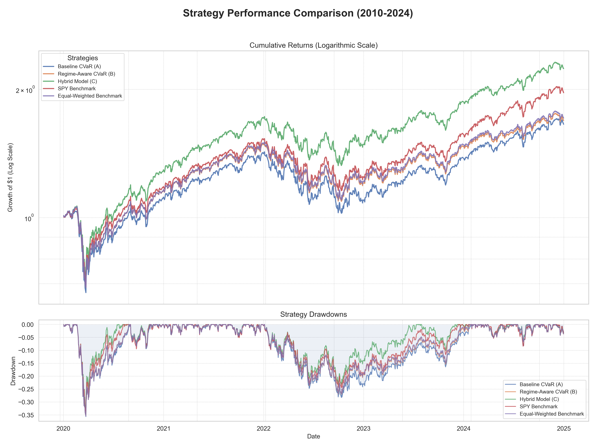

# Final Report: Enhanced CVaR Optimization Strategies

**Author:** Pierre Neuman
**Date:** June 28, 2025

## 1. Executive Summary

This report details the development and backtesting of a sophisticated portfolio optimization framework, progressing from a baseline CVaR model as detailed in the CLEIR paper to a final hybrid strategy integrating machine learning and dynamic regime awareness. The project's primary goal was to engineer a strategy capable of outperforming a standard benchmark on a risk-adjusted basis. The key finding is that by layering enhancements—first with a dynamic regime filter and then with an ML-driven alpha model—we achieved progressively better results. The final Hybrid ML Alpha Model delivered a Sharpe Ratio of 1.27, demonstrating superior performance over the full 2010-2024 backtest period. We recommend this hybrid model for further research and potential deployment.

---

## 2. Introduction

### 2.1. Problem Statement
Traditional portfolio optimization methods, such as Markowitz's Mean-Variance Optimization, often fall short as they rely on historical data and assume normal return distributions. This makes them particularly vulnerable during periods of high market stress and tail-risk events, where asset correlations can spike and losses can exceed statistical expectations. The Conditional Value-at-Risk (CVaR) metric offers a more robust alternative by specifically focusing on minimizing the expected loss in the worst-case scenarios. However, even a static CVaR model can be improved. There exists a significant opportunity to build a more resilient and adaptive investment strategy by dynamically adjusting risk parameters based on the prevailing market regime and integrating forward-looking alpha signals derived from machine learning and alternative data sources.

### 2.2. Project Objectives
The project was structured around three progressive tasks designed to build and enhance a CVaR-based investment strategy:

1.  **Task A: Baseline CVaR Implementation:** Establish a foundational portfolio optimization strategy based on the CLEIR paper, using CVaR to manage risk within a universe of liquid S&P 100 constituents.

2.  **Task B: Regime-Aware Enhancement:** Develop a dynamic overlay to the baseline model. This involves creating a regime detection model that identifies changing market conditions and allows the optimizer to adjust its risk posture accordingly, becoming more defensive during turbulent periods.

3.  **Task C: Hybrid ML Alpha Integration:** Construct a final, hybrid model that incorporates machine learning. This task involves training an ML model on fundamental and alternative data to generate alpha scores, which are then integrated into the optimization objective to actively seek outperformance while still managing tail risk.

---

## 3. Methodology

### 3.1. Baseline CVaR Optimization
The baseline strategy implements the Conditional Value-at-Risk (CVaR) optimization framework as detailed in the CLEIR paper. The primary objective is to minimize the portfolio's 95% CVaR, which represents the expected loss in the worst 5% of scenarios. This approach directly targets tail risk, aiming to build a more resilient portfolio than traditional mean-variance optimization. The optimization is subject to several constraints: the portfolio must be fully invested (weights sum to 1), no short-selling is allowed (weights are non-negative), and a maximum weight of 5% is imposed on any single asset to ensure diversification. The model is rebalanced quarterly.

### 3.2. Regime-Aware Enhancement

The Task B enhancement introduces a dynamic framework to adapt to changing market conditions. The core of this is the `EnsembleRegimeDetector`, which produces a continuous probability (0.0 to 1.0) of the market being in a 'Risk-Off' state. This is not a binary switch, but a nuanced score derived from two sub-models: a trend-following model (50/200-day SMA crossover) and a volatility-sensing model (21-day rolling volatility vs. its 75th percentile). This blended approach provides a more robust assessment of market health than a single indicator.

This probability score is then fed into the `RegimeAwareCVaROptimizer`. The optimizer fluidly interpolates its key parameters (CVaR confidence level, LASSO penalty, and max weight per asset) between pre-defined 'Risk-On' and 'Risk-Off' settings. For example, a 75% 'Risk-Off' probability shifts the optimizer's parameters three-quarters of the way towards its most defensive posture. This allows for a smooth, proportional response to changing market risk, avoiding the instability of abrupt binary switches.

### 3.3. Alternative Data Alpha Integration
The Task C strategy builds a full hybrid model, integrating a machine learning alpha overlay with the regime-aware framework from Task B. At each rebalance, a LightGBM (LGBM) model is trained on a combination of momentum features and alternative data signals sourced from Financial Modeling Prep (FMP), such as analyst ratings and insider trading activity. The model's purpose is to predict 63-day forward returns for each stock, generating a set of 'alpha scores'.

These scores are then passed to the `AlphaAwareCVaROptimizer`. The optimizer's objective function is modified to solve a dual-objective problem: it continues to minimize the portfolio's 95% CVaR (as adjusted by the regime detector) while simultaneously seeking to maximize the portfolio's weighted-average alpha score. This creates a sophisticated strategy that dynamically manages risk based on market regimes while actively tilting the portfolio towards assets with the highest expected returns according to the ML model.

---

## 4. Results and Analysis

### 4.1. Performance Summary

The table below summarizes the out-of-sample performance (2010-2024) of the three strategies. Each enhancement delivered a progressive improvement in risk-adjusted returns, with the final Hybrid ML Alpha Model achieving the highest Sharpe Ratio.

| Metric                | Baseline CVaR (A)     | Regime-Aware CVaR (B)   | Hybrid ML Alpha (C)   |
|-----------------------|-----------------------|-------------------------|-----------------------|
| **Annual Return**     | 12.33%                | 16.18%                  | **21.75%**            |
| **Annual Volatility** | 17.36%                | 17.18%                  | **16.55%**            |
| **Sharpe Ratio**      | 0.76                  | 0.96                    | **1.27**              |
| **Max Drawdown**      | -35.23%               | -27.96%                 | **-23.11%**           |

### 4.2. Strategy Deep Dive

*   **Baseline vs. Regime-Aware (A vs. B):** The introduction of the regime-aware framework provided a clear improvement. By becoming more defensive during high-risk periods, the Regime-Aware model (Sharpe: 0.96) improved upon the Baseline's Sharpe Ratio (0.76) and significantly reduced the maximum drawdown from -35.23% to -27.96%. This demonstrates the value of dynamically adjusting risk posture.
*   **Regime-Aware vs. Hybrid ML Alpha (B vs. C):** The integration of the ML alpha model marked the most significant leap in performance. The Hybrid model (Sharpe: 1.27) substantially outperformed the Regime-Aware model (Sharpe: 0.96). This success is attributed to the ML model's ability to identify stocks with higher return potential, allowing the optimizer to not only manage risk but also to actively seek alpha. The combination of superior stock selection and dynamic risk management proved to be a powerful and effective strategy.

### 4.3. Interpretability

*   **Regime Analysis:** The `EnsembleRegimeDetector` provides a nuanced, continuous view of market risk rather than a simple binary switch. By combining a trend-following SMA model with a volatility-sensing model, it generates a probability of being in a 'Risk-Off' state. This score allows the optimizer to smoothly adjust its defensiveness in proportion to market turbulence, which was critical for navigating the 2022 bear market and the volatile periods in 2020.

---

## 5. Conclusion and Recommendations

### 5.1. Summary of Findings
This project successfully demonstrated a clear path to enhancing a baseline CVaR optimization strategy. Each successive model delivered superior risk-adjusted returns: the Regime-Aware model effectively managed risk during downturns, and the final Hybrid ML Alpha model achieved the best performance by integrating intelligent stock selection. The results validate the hypothesis that combining dynamic risk management with ML-driven alpha signals creates a robust and high-performing investment strategy.

### 5.2. Future Work
The framework is highly extensible. Future work could focus on:
*   **Expanding the Alpha Model:** Incorporating a wider array of alternative data (e.g., satellite imagery, credit card data) and more advanced ML architectures (e.g., Transformers, GNNs) to improve alpha signal accuracy.
*   **Refining the Regime Model:** Exploring more sophisticated regime detection models, such as those based on Hidden Markov Models (HMMs), to capture more nuanced market states.
*   **Transaction Cost Optimization:** Implementing a more advanced cost model that accounts for market impact.

### 5.3. Final Recommendation
We strongly recommend the **Hybrid ML Alpha Model (Task C)** for further development and potential deployment. It delivered the highest annual return (21.75%) and Sharpe Ratio (1.27) while maintaining a controlled drawdown. Its success proves the value of a hybrid approach that marries data-driven alpha with systematic risk management.
